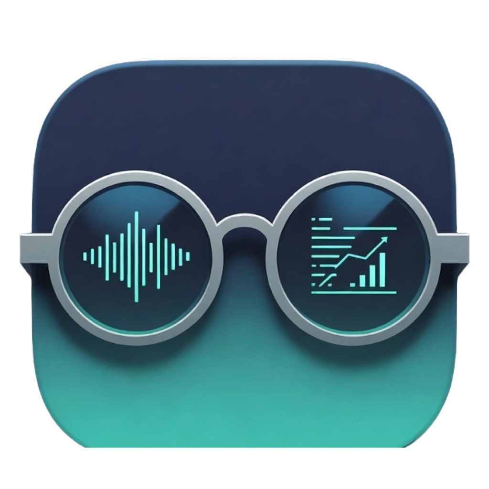

#  Edith

A native SwiftUI menu bar app for the Mac — a dark, minimal personal control
center built to run 24/7 on near-zero resources.

## Features

- **Rate-limit rings** — session (5h) and weekly usage as live animated gauges with second-by-second countdowns and a 24h history spark.
- **Menu-bar limits** — optional second menu bar readout of session + weekly %, tinted by a time-aware risk model.
- **Smart notifications** — threshold, ahead-of-pace, burning-hot, back-to-green and pre-reset alerts, all optional, with a self-diagnosing test button.
- **Activity heatmap** — GitHub-style daily spend calendar across your full history.
- **Token & cost stats** — today / week / billing cycle, filterable by agent (Claude Code, Codex, OpenCode…).
- **One-click dashboard** — opens the full HTML usage dashboard in the browser, carrying your filters.
- **Music player** — plays your local music folder with thumbnails, drag-to-seek, fades, auto-advance and media keys.
- **System tools** — prevent-sleep toggle and a keyboard-cleaning lock with a 60s auto-restore.
- **Global shortcut** — toggle the panel from anywhere (default ⌥⌘E), re-recordable.
- **Presenter mode** — blurs track names and spend figures for screen sharing.
- **Local-first** — usage data never leaves your Mac; optional iCloud backup that merges across machines.

## Build & install

```bash
cd apps/macos
./build.sh            # build + run from dist/
./build.sh --install  # build + copy to /Applications + launch
./test.sh             # run the Swift test suite
```

Needs only Xcode Command Line Tools (Swift 6).
