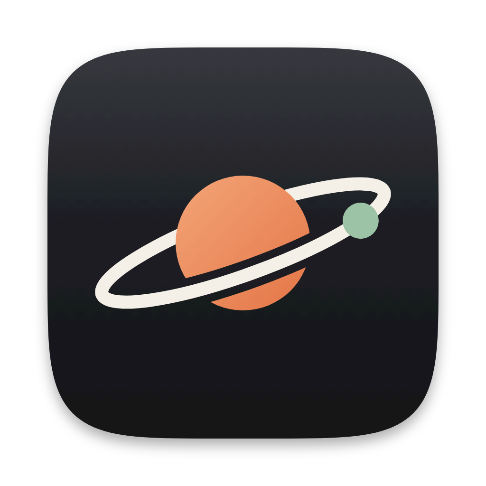

#  Edith

A native desktop control center for macOS. Edith replaces a shelf of
single-purpose utilities and idles at about 22 MB.

Free and open source under the [GPL-3.0](LICENSE). Every feature is in the one
app. No licence key, no account, no paid tier.

**[Download for macOS](https://github.com/pulkitxm/edith/releases/latest/download/Edith.dmg)**
or install it with Homebrew:

```
brew install --cask pulkitxm/tap/edith
```

That taps, installs the app and puts `ed` and `edh` on your `PATH`. Edith updates itself
through Sparkle, so `brew upgrade --cask --greedy edith` is the way to force
Homebrew to fetch a newer release. Full command list:
[docs/homebrew.md](docs/homebrew.md), and
[how it all works](docs/homebrew-internals.md).

[edith.pulkit.page](https://edith.pulkit.page)
· [Wiki](https://github.com/pulkitxm/edith/wiki)
· [Support](SUPPORT.md)
· [Security](SECURITY.md)

Edith requires macOS 14 or later on Apple Silicon.

## Features

**Agent usage**

- **Local accounting** - Claude, Codex and pi activity is attributed to the right machine, repository, worktree and chat without sending the history anywhere.
- **Rate-limit rings** - Claude and Codex session and weekly usage as live gauges with second-by-second countdowns and history; Claude's scoped Fable window is tracked too.
- **Menu bar readout** - choose which Claude and Codex windows appear, with compact or roomy layouts and a time-aware risk tint.
- **Alerts** - threshold, ahead-of-pace, burning-hot, back-to-green and pre-reset notifications, all optional.
- **Dashboard** - KPIs with per-day, model, source, project and hourly charts, plus a sortable model table.
- **Activity heatmap** - GitHub-style daily spend calendar across your full history.
- **Project drilldown** - spend by project, worktree and chat, across every collected agent.
- **Fleet usage** - the same collector runs on your SSH machines and folds their agents in as their own sources, so the totals cover every box you code on.

**Companion**

- **Private memory** - deploy the multi-container backend on this Mac or an SSH machine, then reach it through a localhost tunnel.
- **Capture and library** - give it notes, recordings, images, video and PDFs; failed recordings wait in a local outbox instead of disappearing.
- **Evidence-backed chat** - ask questions over your own history, inspect citations, or ask three independent lenses for a second opinion.
- **Your data, your exit** - export or import the memory, erase individual episodes, wipe everything, move the deployment, and inspect its health and logs from Edith.

See the [Companion guide](docs/companion.md) for hosting requirements, data flow,
model choices and recovery.

**Machines**

- **One fleet view** - add the local Mac and SSH hosts, monitor live CPU, memory, disks, temperatures, GPUs and running processes, and detach any machine into its own window.
- **Terminal, files and workspaces** - keep terminal tabs, browse and transfer files, preview remote content, and arrange saved split-pane workspaces.
- **Containers** - inspect Docker Compose groups, resources, configuration and logs, then start, stop, restart or remove containers.
- **Power and cooling** - wake, restart or shut down hosts; read fan speeds and temporarily switch supported platform profiles with automatic rollback.

See the [remote machines guide](docs/remote-machines.md) for connection, privilege
and platform details.

**Everything else on the shelf**

- **Music player** - your local music folder with thumbnails, drag-to-seek, fades, auto-advance and media keys; also controls Spotify and Apple Music.
- **Clipboard history** - a global paste panel with search and paste-in-place.
- **Color picker** - system-wide eyedropper on a hotkey, with swatch history.
- **Notch shelf** - the notch becomes a hover-to-open shelf for drag-and-drop file staging, now-playing controls and a camera check.
- **Calendar** - your agenda grouped by day, with one-tap join links.
- **Audio mixer** - per-app volume control.
- **Mic mute** - system-wide microphone kill switch with a menu bar indicator.
- **Focus dim** - dims every screen except the window you are working in.
- **System tools** - prevent-sleep toggle, CPU and memory readout, and a keyboard-cleaning lock that auto-restores after 60s.
- **Lid awake** - keeps the Mac running with the lid shut and unplugged, with timed or lid-cycle sessions, battery floors and automatic sleep restoration.
- **Disk cleaner** - scans build caches, package managers and old logs.
- **Global shortcut** - toggle the panel from anywhere, ⌥⌘E by default and re-recordable.

## Command line

Installing Edith installs `ed`, a first-class CLI that reaches everything the UI
does. `edh` and `edith` are the same binary.

```
ed config set preventSleep true     every setting the UI exposes, applied live
ed lid-awake on --for 30m           keep running with the lid shut for 30 minutes
ed usage limits --json              the same numbers the rings show
ed machines ls                      the computers Edith can reach over SSH
ed tuf docker ps                    run anything on one of them
```

Every read command takes `--json`, stdout is exactly one document, logs go to
stderr, and exit codes are reliable, so an agent can drive Edith headlessly.

Full reference: **[docs/cli](docs/cli/README.md)**, one page per command group,
also published to the [wiki](https://github.com/pulkitxm/edith/wiki). `ed guide`
prints the same material as a built-in manual.

Lid Awake needs one-time approval for Edith's background helper. Read the
[Lid Awake guide](docs/lid-awake.md) before using it in a closed bag or on battery.

## Privacy

Usage data never leaves your Mac. There is no account and no telemetry.
Rate-limit checks go directly from your machine to your provider. Optional iCloud
backup merges selected app data across your own Macs and nowhere else.

The optional Companion stores its memory on the machine you choose. Local
embedding, vision and speech models run there. Reasoning can stay on that host or
use a provider you configure, in which case the requested context goes directly
from your host to that provider. Edith operates no data service in between.

**Presenter mode** blurs spend figures, track names and calendar entries for
screen sharing, and detects screen shares automatically.

## Performance

Built to sit in the menu bar all day. Measured on an Apple M4 Pro, CPU as a
share of one core:

| State | CPU | Memory |
| --- | --- | --- |
| Idle, panel closed | ~0% | ~22 MB |
| Music playing, panel closed | ~1% | ~40 MB |
| Paused | <1% | ~40 MB |

Disabling a tab tears down its timers and background jobs entirely, per-frame UI
only redraws while the panel is open, and the usage collector caches parses so a
refresh only touches files that changed.

## Contributors

Thank you to everyone who has shipped a change in Edith.

<!-- contributors:start -->

<table>
  <tr>
    <td align="center"><a href="https://github.com/pulkitxm"><br /><sub>pulkitxm</sub></a></td>
    <td align="center"><a href="https://github.com/Vivek09Chahal"><br /><sub>Vivek09Chahal</sub></a></td>
    <td align="center"><a href="https://github.com/claude"><br /><sub>claude</sub></a></td>
    <td align="center"><a href="https://github.com/Sohan-Rout"><br /><sub>Sohan-Rout</sub></a></td>
  </tr>
</table>

<!-- contributors:end -->

## Contributing

Issues and pull requests are welcome. See [CONTRIBUTING.md](CONTRIBUTING.md) for
building from source, the test suite, and how releases are cut. Participation is
governed by the [Code of Conduct](CODE_OF_CONDUCT.md), and larger decisions follow
the process in [GOVERNANCE.md](GOVERNANCE.md).

## Licence

Edith is free software licensed under the [GNU General Public License v3.0](LICENSE).
You may use, study, modify and redistribute it; any version you distribute must
also be released under the GPL-3.0 with its source available.

Sparkle, used for in-app updates, is distributed under the MIT licence.

## Attribution

The lid-awake feature was inspired by [Awayke](https://github.com/daemonphantom/Awayke),
an MIT-licensed macOS utility by daemonphantom.
