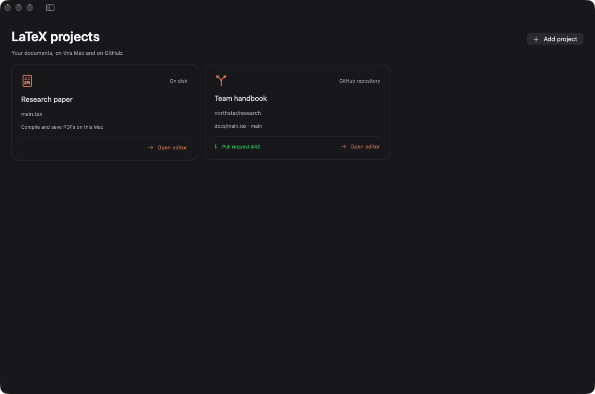
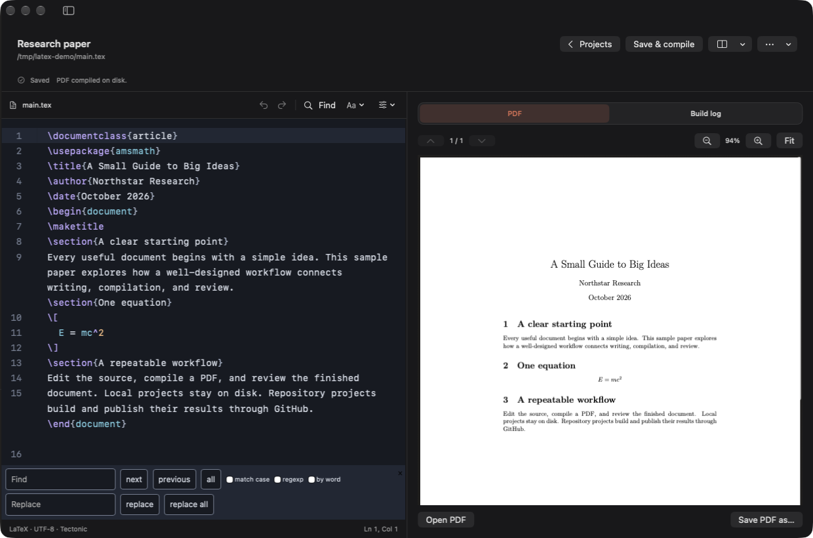
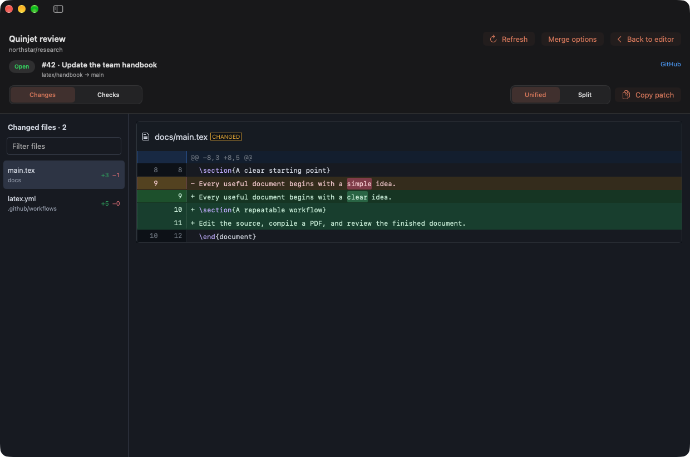

# LaTeX

Enable LaTeX in Extensions, then open it from Media. Add as many projects as you
need. The project library and document editor have separate screens. Select Open
editor on a project card, or add a project to open its editor immediately. Use
Back to projects after saving, submitting, or discarding your edits. A project points to either a local `.tex` file or a GitHub repository,
base branch, and relative source path. An empty base branch uses the repository
default. Adding a project verifies that its source exists and is UTF-8 text.

## Local documents

Install Tectonic from the extension's tool controls. Choose a `.tex` file, edit
its source, and select Save & compile. The source stays on disk and the PDF is
written beside it. The output pane shows the PDF or build log. Compilation runs
from the source directory so relative includes and assets resolve normally.
Edith refuses to save over source changes made by another editor.
The source editor includes LaTeX syntax colors, line numbers, command completion,
bracket matching, undo and redo, and inline search and replace. Tab indents and
Shift-Tab outdents. Insert LaTeX adds formatting, sections, equations, and lists.
Editor options control wrapping and text size. Layout switches between a split
workspace, source only, and PDF only. Save status occupies a fixed strip so typing
does not move the editor or PDF pane. Use Command-S to save
and compile. The PDF pane has page navigation, zoom, fit, and Save PDF as.

## Repository documents

Install GitHub CLI and Pukbot, then authenticate with `gh auth login`.
The account needs permission to push branches and add GitHub Actions workflows.
Use `owner/repository` and a relative path such as `papers/main.tex`.

Edit the source and select Create pull request, or press Command-S to save and
compile through GitHub. Edith creates a branch from the
commit that supplied your source and commits the edited source plus a dedicated
compiler workflow through Pukbot. Subsequent edits update the same open PR.
Repository sources remain in memory until submitted. Only project pointers and
PR identifiers are saved locally. No repository checkout or local PDF is made.
If submission fails after creating the branch or PR, retry reconnects the
existing remote work. Source conflicts are reported instead of overwritten.

Choose pdfLaTeX for documents using pdfTeX commands such as `\pdfgentounicode`.
The repository compiler uses a full TeX Live environment with pdfLaTeX. Local
pdfLaTeX compilation needs latexmk and a local TeX Live installation on PATH.

GitHub Actions compiles the document on pull requests and pushes and uploads the
PDF as a run artifact. Command-S saves edits and compiles, or recompiles the
already saved revision. Recompile does the same from the toolbar. The editor
loads an existing PDF when opened and loads the new PDF when its build finishes.
Build status and View PDF build show progress or compiler failures. Refresh PDF
retries preview loading; Builds & PDF artifacts opens GitHub. PDF previews never write repository artifacts to disk.
Use Review in Quinjet for changed files, highlighted unified or split diffs,
file filtering, checks, and merge controls. The native review screen reads GitHub
directly and keeps its data in memory, so it works without a checkout.
Merge options offer a squash merge with branch deletion or a squash merge after
required checks pass. Branch protections remain enforced. Refresh or reload to
see updated checks and completed merges. A new edit after a completed PR starts
a new review branch.

Discard or submit unsaved changes before switching projects or removing a
library entry. Removing an entry only removes its pointer from the library.

```sh
ed extensions enable latex
ed app reveal latex
ed tools install tectonic
```

## Editor assets

The CodeMirror editor ships inside the app and works offline. Its WebKit view
uses a nonpersistent data store and blocks network requests. Repository drafts
are never written to browser storage. To rebuild the bundled editor, run
`bun install --cwd tools/latex-editor --frozen-lockfile`, then
`bun run --cwd tools/latex-editor build`. Verify the committed bundle with
`bun run --cwd tools/latex-editor check`. Dependency licenses ship beside the
editor assets.

## Command line

Use `ed latex ls --json` to discover projects and `ed latex read PROJECT --json`
to read source with a revision token. `write` accepts raw UTF-8 stdin; `edit`
accepts checked literal replacements as JSON stdin. Both preview first and
apply with `--yes`, saving and compiling locally or submitting a GitHub PR.
`compile`, `preview`, `review`, `merge`, and `remove` complete the same flow.
See the [CLI reference](cli/latex/README.md). The Edith LaTeX Edit plugin skill
teaches this workflow and can be installed from Plugins or `ed skills install`.

## Preview

These captures use synthetic documents and mocked GitHub responses. The local
PDF was compiled in the running app.






